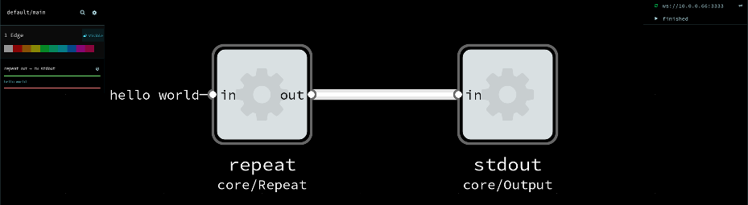

# Flowtrace

[](https://greenkeeper.io/)

A `flowtrace` is a persisted record of the execution of an Flow-based Programming (FBP) or dataflow program.
It is used for retroactive (after-the-fact) debugging; to locate, understand and fix bugs. 

The concept is analogous to a 'stacktrace' or 'core dump' for imperative code.

This project will define a data format to store traces in,
and provide debugging tools for working with these traces.

## Status
Minimally useful

* NoFlo has support for creating flowtraces,
from [noflo-nodejs 0.6](https://github.com/noflo/noflo-nodejs#debugging)
and [noflo-runtime-msgflo 0.2.2](https://github.com/noflo/noflo-runtime-msgflo#debugging)
* Several commandline tools exist for working with flowtraces
* Note: File format not 100% finalized
* Some not-yet-useful timeline UI prototypes exist

See [braindump](./doc/braindump.md) and [UI notes](./ui/notes.md) for ideas/plans.

## Installing

First make sure you have [Node.js](http://nodejs.org/) with NPM installed.

To install locally in a project. Recommended.

    npm install flowtrace
    export PATH=./node_modules/.bin:$PATH

To install globablly on your system

    npm install -g flowtrace

## Display flowtrace on commandline

`flowtrace-show` reads a flowtrace, and renders a human-friendly log output from it.

    ./bin/flowtrace-show mytrace.flowtrace.json

Example output:

```
-> IN repeat CONN
-> IN repeat DATA hello world
-> IN stdout CONN
-> IN stdout DATA hello world
-> IN repeat DISC
-> IN stdout DISC
```

When used in a terminal, supports colors.

## Show a flowtrace in Flowhub

`flowtrace-replay` reads a flowtrace, and then acts as a live FBP runtime. That means it can be used with
any FBP IDEs/client which support the [FBP runtime protocol](http://noflojs.org/documentation/protocol/).

    flowtrace-replay mytrace.flowtrace.json

By default this will open [Flowhub](app.flowhub.io) in your browser, automatically connect and show you the graph.
To replay the data press the play button. You should then see the data flowing through edges.



You can specify which `--ide` to use, and disable automatic opening of browser with `-n`.

    flowtrace-replay --ide http://localhost:8888 -n

You can also set the `--host` and `--port`. See `--help` for all options.
